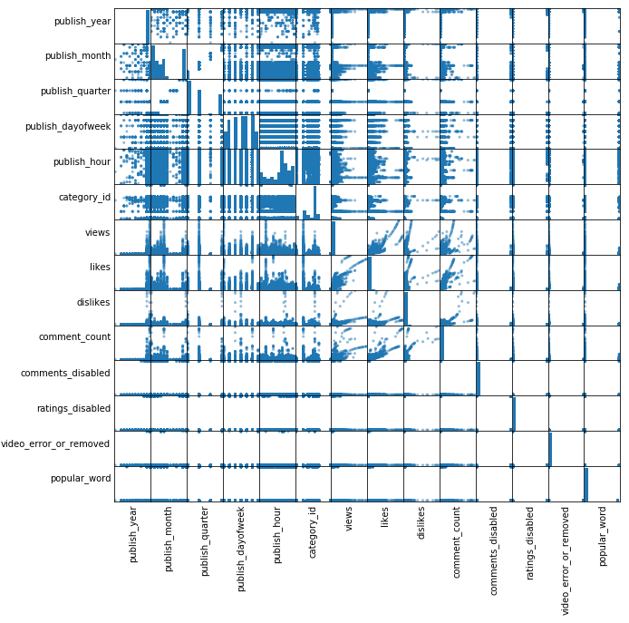
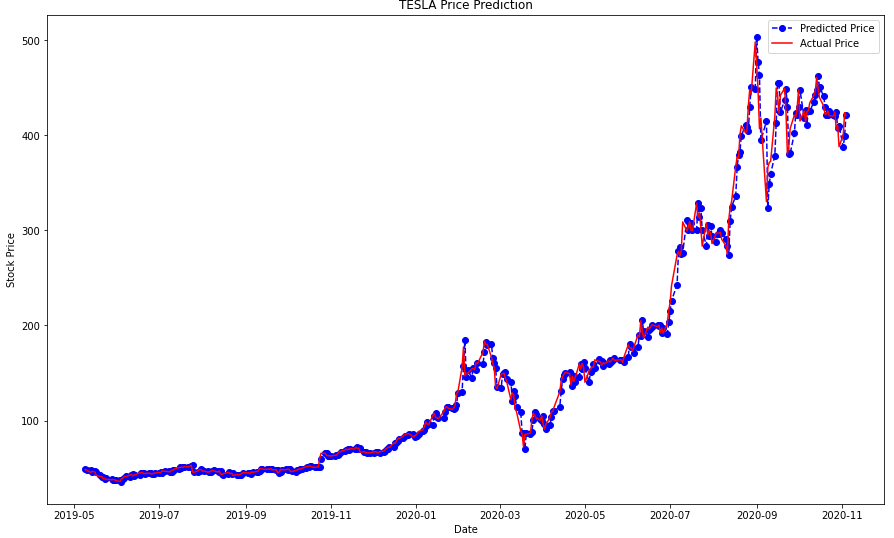
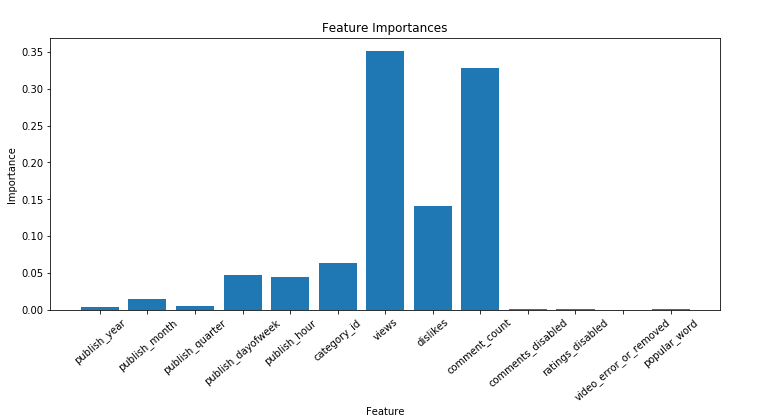
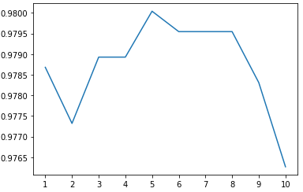

  

      <ul class="nav">
          <li><a href="https://github.com/ngau9567/ngau9567.github.io/tree/master/assets/Kahang_Ngau.pdf">cv</a></li>
          <li><a href="https://ngau9567.github.io">github</a></li>
          <li><a href="http://www.linkedin.com/in/kahang-ngau">LinkedIn</a></li>
      </ul>
  

### Portfolio

<table class="wide">
<tr>
  <td class="left">
    
  </td>
  <td class="right">
    
  </td>
</tr>
<tr>
  <td class="left">
    
  </td>
  <td class="right">
    
  </td>
</tr>
</table>

  

      <ul class="nav">
          <li><a href="morefigs.html">see more figures</a></li>
      </ul>
  

