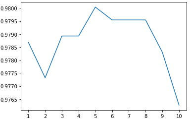

  

      <ul class="nav">
          <li><a href="{{ BASE_PATH }}/assets/Kahang_Ngau.pdf">cv</a></li>
          <li><a href="https://github.com/ngau9567">github</a></li>
          <li><a href="www.linkedin.com/in/kahang-ngau">linkedin</a></li>
      </ul>
  

### Portfolio
<table class="wide">
<tr>
  <td class="left">
    
  </td>
  <td class="right">
    
  </td>
</tr>
<tr>
  <td class="left">
    
  </td>
  <td class="right">
    
  </td>
</tr>
<tr>
    <td class="left">
        
    </td>
</tr>
</table>

  

      <ul class="nav">
          <li><a href="index.html">back</a></li>
      </ul>
  

